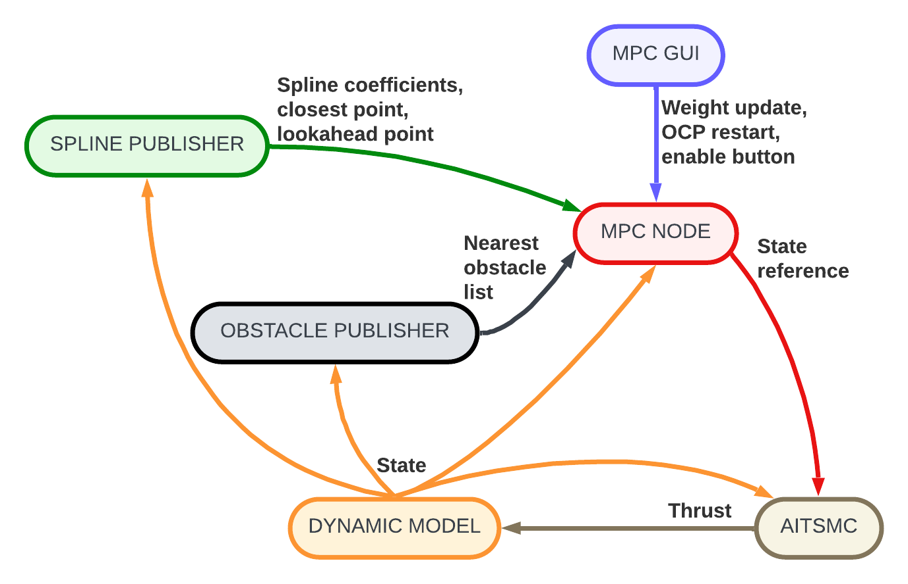

# ASV Nav

A ROS 2 navigation stack for an Autonomous Surface Vessel (ASV) ferry, implementing
Nonlinear Model Predictive Control (NMPC) for spline-tracking with dynamic obstacle
avoidance, cascaded with an Adaptive Integral Terminal Sliding Mode Controller
(AITSMC) for low-level robust control against wind and current perturbation and thrust allocation.


## Table of contents

1. [Repository structure](#repository-structure)
2. [System architecture](#system-architecture)
3. [Packages](#packages)
   - [asv\_control](#asv_control)
   - [asv\_interfaces](#asv_interfaces)
   - [asv\_utils](#asv_utils)
   - [asv\_description](#asv_description)
4. [NMPC formulation](#nmpc-formulation)
5. [Dependencies](#dependencies)
6. [Building](#building)
7. [Running](#running)
8. [Analysis tools](#analysis-tools)


## Repository structure

```
asv_nav/
├── asv_control/        # Control: MPC + AITSMC nodes, spline publisher, teleoperation with and xbox controller.
├── asv_description/    # Visualization: URDF and RViz configuration, Foxglove files.
├── asv_interfaces/     # Custom ROS 2 message definitions and custom rviz plugins.
└── asv_utils/          # Utility: Obstacle publisher, CSV path loader, rosbag plotter.
```


## System architecture

<picture>
  <source media="(prefers-color-scheme: dark)" srcset="./docs/architecture_dark.png">
  <source media="(prefers-color-scheme: light)" srcset="./docs/architecture_light.png">
  
</picture>

## Packages

### asv\_control

Contains all control logic.

| Node / Script           | Language | Description                                                                                                                                                                                                                      |
| ----------------------- | -------- | -------------------------------------------------------------------------------------------------------------------------------------------------------------------------------------------------------------------------------- |
| `mpc_node`              | C++      | Real-time MPC using the ACADOS-generated solver. Runs at 20 Hz. Tracks Catmull-Rom splines with dynamic obstacle avoidance and adaptive weight scheduling.                                                                       |
| `spline_publisher_node` | C++      | Builds a Catmull-Rom spline chain from incoming waypoints, finds the closest point on the spline to the ASV, and publishes spline parameters, current `t`, and lookahead `t_la` to the MPC.                                      |
| `aitsmc_node`           | C++      | Low-level controller. Accepts velocity or pose references from the MPC and computes azimuth thruster commands at 100 Hz. Supports two modes: **SSY** (surge/sway/yaw velocity tracking) and **XYH** (x/y/heading pose tracking). |
| `teleop_xbox_node.py`   | Python   | Xbox controller teleoperation for manual testing.                                                                                                                                                                                |
| `mpc_gui.py`            | Python   | Live parameter-tuning GUI: adjusts MPC weights and horizon at runtime via ROS parameters.                                                                                                                                        |
| `asv_mpc.py`            | Python   | Standalone ACADOS OCP setup and closed-loop simulation. Used offline to prototype the MPC and generate C code (`c_generated_code_asv_ocp/`).                                                                                     |
| `asv_dynamics.py`       | Python   | CasADi symbolic model for the ASV. Exports the `AcadosModel` consumed by `asv_mpc.py`.                                                                                                                                           |

**Launch files**

| File               | Launches                                                                     |
| ------------------ | ---------------------------------------------------------------------------- |
| `asv_launch.py`    | `spline_publisher_node`, `mpc_launch`, `obstacle_publisher`, `dynamic_model_node`, `aitsmc_launch` |
| `mpc_launch.py`    | `mpc_node`, `mpc_gui` |
| `aitsmc_launch.py` | `aitsmc_node` with tunable AITSMC parameters                                 |
| `teleop_launch.py` | `teleop_xbox_node`                                                           |

---

### asv\_interfaces

Custom message definitions shared across all packages.

| Message        | Fields                                                      | Purpose                               |
| -------------- | ----------------------------------------------------------- | ------------------------------------- |
| `State`        | `x, y, ψ, u, v, r, u_dot, v_dot, r_dot`                     | 9-DOF ASV state (implementation for 6)|
| `Obstacle`     | `x, y, v_x, v_y, color, type, uuid`                         | Single dynamic obstacle with velocity |
| `ObstacleList` | `Obstacle[]`                                                | List of obstacles                     |
| `Thrust`       | `force0, force1, ang0, ang1`                                | Azimuth thruster commands             |
| `AitsmcDebug`  | `e, e_i, e_i_dot, s, k, u`                                  | AITSMC internal state for debugging   |

Also contains RViz plugins (`asv_interfaces/src/rviz_tools/`) for visualizing the ASV footprint and obstacle markers.
In RViz, besides the regular keyboard shortcuts, 'x' centers the current view to wherever the ASV is, 'f' resets and adds the first spline's point, 't' adds the second (and final) spline's point, and 'g' adds a new point to the spline. All of the spline's points shortcuts appear as a PoseStamped message because their orientation defines the shape of the spline.

---

### asv\_utils

Support nodes not part of the control loop.

| Node / Script                | Description                                                                                                                                                                               |
| ---------------------------- | ----------------------------------------------------------------------------------------------------------------------------------------------------------------------------------------- |
| `obstacle_publisher`         | Simulates up to n (set to 3 but modular) dynamic obstacles with bouncing-wall kinematics. Obstacles can also be placed interactively from RViz via `/rviz/dyn_obs`. Publishes full and nearest-3 obstacle lists. |
| `csv_path_publisher_node`    | Reads a CSV of waypoints and publishes them as a `PoseArray` on `/asv/goals/pose_array`.                                                                                                  |
| `plot_rosbag.py`             | Offline analysis tool: reads a ROS 2 SQLite bag and produces publication-quality figures (trajectory, crosstrack/alongtrack/heading errors, control inputs, obstacle distances).          |

---

### asv\_description

URDF model, RViz configuration files for visualization in RViz2, and Foxglove JSON file for graphic debugging.


## NMPC formulation

The MPC is formulated as a Nonlinear Least-Squares OCP and solved with
**ACADOS SQP-RTI** (Real-Time Iteration) using **PARTIAL_CONDENSING_HPIPM** as
the underlying QP solver.

### State vector (13 states)

```
x = [x, y, ψ, u, v, r, t, obs_x₁, obs_y₁, obs_x₂, obs_y₂, obs_x₃, obs_y₃]
```

- `x, y, ψ` — inertial position and heading
- `u, v, r` — surge, sway, yaw rate
- `t` — spline progress parameter (integrates `dt_ctrl`)
- `obs_xᵢ, obs_yᵢ` — obstacle positions, propagated with constant-velocity prediction

### Control vector (4 inputs)

```
u_ctrl = [u_Tx, u_Ty, u_Tz, dt_ctrl]    (all in [−1, 1])
```

`dt_ctrl` advances the spline parameter `t`, so the MPC can implicitly
control forward progress along the path.

### Cost function

Stage and terminal costs are **NONLINEAR_LS** with `sqrt(weight)` baked into
the residuals, enabling runtime weight updates without solver recompilation:

| Residual                               | Weight                   | Description                           |
| -------------------------------------- | ------------------------ | ------------------------------------- |
| `x − s_x(t)`, `y − s_y(t)`             | `w_cross`                | Crosstrack error                      |
| `x − s_la_x(t_la)`, `y − s_la_y(t_la)` | `w_along`                | Alongtrack (lookahead) error          |
| `sin((ψ − ψ_ref)/2)`                   | `w_heading`              | Continuous heading alignment with spline tangent |
| `u_Tx, u_Ty, u_Tz`                     | `w_input`                | Control effort                        |
| `u, v, r`                              | `w_surge, w_sway, w_yaw` | Velocity damping                      |
| `1 / max(Eᵢ, ε)^AVO_POWER`             | `w_avoidance`            | Avoidance cost per obstacle           |

The terminal node uses all residuals except control inputs, scaled by `sqrt(w_terminal)`.

### Obstacle avoidance

Each obstacle is represented by a **soft ellipsoidal constraint** in the
ASV body frame with semi-axes (95 m longitudinal, 50 m lateral):

```
Eᵢ = (ox_body / A_eff)² + (oy_body / B_eff)² ≥ 1
```

This constraint is enforced as a **soft nonlinear constraint** with heavy L1/L2
penalties to allow constraint relaxation near
infeasible situations. An additional avoidance **cost term** (inverse ellipse
value) provides a smooth gradient toward safe regions.

### Adaptive weight scheduling

The `MPCNode` continuously re-schedules weights based on two error signals:

- **Crosstrack error** — scales heading/alignment weights linearly between `[min_ce, max_ce]`
- **Along-track (remaining distance)** — scales input/speed weights between `[ae_start, ae_end]`
- **Predicted obstacle proximity** — interpolates between path-tracking weights and avoidance weights

### Solver settings

| Parameter      | Value                         |
| -------------- | ----------------------------- |
| Horizon N      | 25                            |
| Horizon Tf     | 100 s (4 s shooting interval) |
| Integration    | IRK, 4 stages, 3 steps        |
| QP solver      | PARTIAL_CONDENSING_HPIPM      |
| Hessian        | Gauss-Newton                  |
| Globalization  | Merit backtracking            |
| Max QP iters   | 1000                          |
| Control period | 50 ms (20 Hz)                 |
| Warmup iters   | 5 (full SQP), then RTI        |


## Dependencies

### ROS 2

Tested with **ROS 2 Humble** on Ubuntu 22.04.


### ACADOS

The C-generated solver code (`c_generated_code_asv_ocp/`). To **(re)generate** it (e.g., after modifying the OCP):

```bash
cd asv_control/scripts/mpc
python3 asv_mpc.py         # codegen + simulation
python3 asv_mpc.py false   # codegen only, no simulation
```

This requires:
- [acados](https://docs.acados.org/installation/) with Python interface (`pip install acados_template`)
- [CasADi](https://web.casadi.org/) (`pip install casadi`)

### C++ / build

- **Eigen3** (`libeigen3-dev`)
- ACADOS shared libraries (linked via CMake — set `ACADOS_ROOT` or ensure
  acados is installed to a standard prefix).

### Python (analysis / simulation)

```bash
pip install casadi acados_template numpy matplotlib scipy rosbags
```


## Building

```bash
# First, create a ROS 2 workspace if you don't already have it and clone the repository.
cd
mkdir -p ros2_ws/src
cd ros2_ws/src
git clone https://github.com/MaxPacheco02/asv_nav.git
```

```bash
# From the ROS 2 workspace root
cd ~/ros2_ws
colcon build --packages-select asv_interfaces asv_utils asv_control asv_description
source install/setup.bash
```

For the first time, build `asv_interfaces` first so generated headers are available to `asv_control`.


## Running

### Full MPC stack

```bash
# Terminal 1 — RViz file launch
ros2 launch asv_description rviz_launch.py

# Terminal 2 — MPC, SMC, Dynamics node, obstacle, spline
ros2 launch asv_control asv_launch.py

# Terminal 3 - Foxglove node
ros2 run foxglove_bridge foxglove_bridge
```

By default, the MPC is off, so you must turn it on by clicking the `MPC enabled` button in the GUI twice.

Also, it is recommended to open the Foxglove Desktop app to view the live plots of the topics with the JSON found in `asv_description/foxglove/MPC.json`.


### Handling simulation in RViz

Besides the custom keyboard shortcuts mentioned in [asv\_interfaces](#asv_interfaces):

- Pressing 'z' resets the view to the current view's *zero*.
- 'p' triggers the `2D Pose Estimate` which teleports the ASV to the desired state.
- The `2D Goal Pose` button which appears on the `tools` toolbar actually publishes a Pose to the topic `/rviz/dyn_obs`, which just sets the new position and direction of any of the current obstacles being published. After this plugin is used, the effect of resetting the dynamics of an obstacle applies to the next obstacle in the list.


### Teleop

```bash
ros2 run asv_control dynamic_model_node
ros2 launch asv_control teleop_launch.py
```

### Pure NMPC simulation (without ROS)

For testing only the NMPC logics and/or generating the acados files for C++ (ROS) implementation.

```bash
cd asv_control/scripts/mpc
python3 asv_mpc.py          # runs closed-loop sim with live matplotlib
python3 asv_mpc.py false    # codegen only
```


## Analysis tools

### `plot_rosbag.py`

Generates publication-quality figures from a recorded experiment:

```bash
cd asv_utils/scripts
python3 plot_rosbag.py <path/to/bag_directory>

# Or for a specific time window (t-avoid can show the MPC solution path at a relative time from t-start).
python3 plot_rosbag.py <path_to_bag> --t-start 550 --t-end 700 --t-avoid 60
```

Produces PDFs/PNGs in `<bag_dir>/figures/` covering:
- XY trajectory with spline reference and obstacle tracks
- Cross-track, along-track, and heading errors over time
- MPC solver time
- Thruster commands (`Tx`, `Ty`, `Tz`)
- Obstacle distances

The script inlines the `asv_interfaces` message definitions so no ROS install is
needed at plot time.

### Live debugging via topics

Key signals to monitor during a run:

| Topic              | What to watch for                                           |
| ------------------ | ----------------------------------------------------------- |
| `/mpc/debug/min_d` | Drops below ~200 m → avoidance weights kick in              |
| `/mpc/sol_time`    | Should stay well under 50 ms; spikes indicate solver stress |
| `/mpc/debug/w_log` | Log-scale weights; large swings = aggressive reweighting    |
| `/mpc/debug/c_e`   | Crosstrack error; should converge to < 10 m in steady state |
